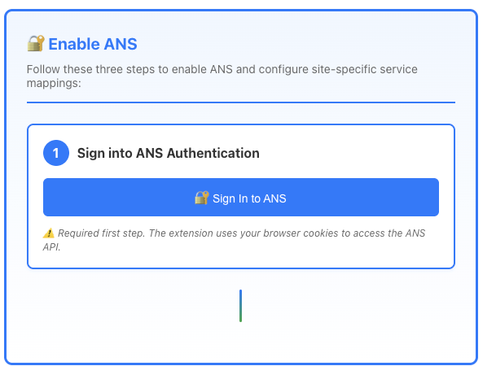
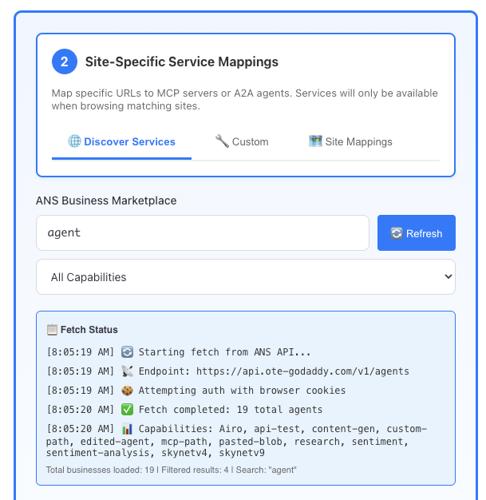
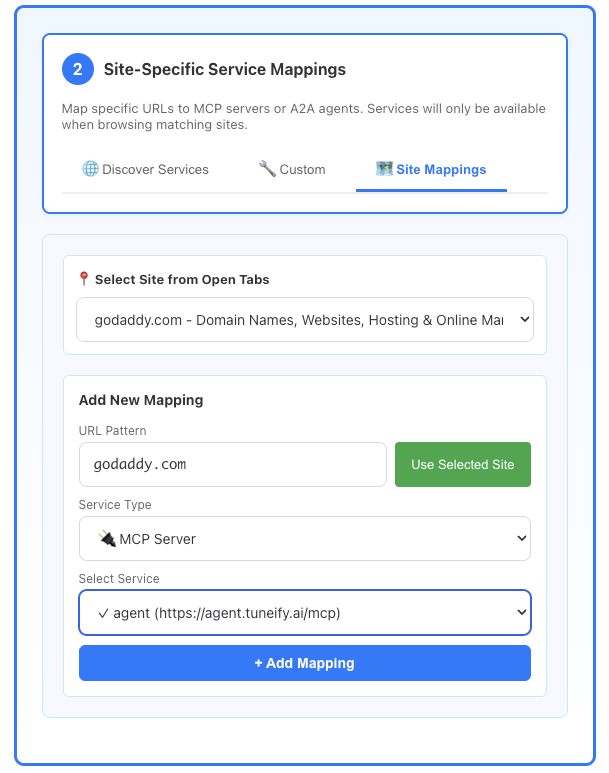
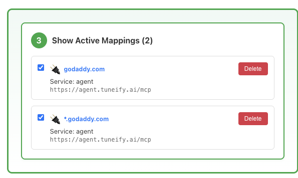

# Setting up ANS Browser demo for "Investor Dinner"

## Chrome Extension Setup

Before you can create site mappings, you need to install and configure the Chrome extension.

> ⚠️ **Important**: Make sure you are connected to **GoDaddy VPN** before proceeding. The extension requires VPN access to connect to ANS services.

### Installation Steps

1. **Download the Extension**
   - Download the latest dev or prod build from [GitHub Actions](https://github.com/gdcorp-engineering/ans-browser-extension/actions/workflows/build.yml)
     - Go to the latest successful workflow run
     - Click on the workflow run to view details
     - Scroll down to the "Artifacts" section
     - Download either the `dev` or `prod` build artifact (zip file)
   - Unzip the downloaded zip file into a folder (e.g., `dist` or `ans-browser-extension`)

2. **Load Extension in Chrome**
   - Open Chrome and navigate to `chrome://extensions/`
   - Enable **"Developer mode"** toggle in the top right corner
   - Click **"Load unpacked"** button
   - Select the folder where you unzipped the extension (e.g., the `dist` folder)
   - The extension should now appear in your extensions list

3. **Access the Extension**
   - The extension adds a sidebar panel that you can access from any tab
   - Look for the extension icon in your Chrome toolbar
   - Click the extension icon or use the keyboard shortcut to open the sidebar

4. **Open Settings**
   - In the extension sidebar, look for a Settings (⚙️) icon or gear icon
   - Click it to open the settings page
   - Alternatively, you can right-click the extension icon and select "Options" or "Settings"

### Updating an Existing Installation

If you already have the extension installed and need to update it with a new version:

1. **Download the Latest Version**
   - Download the latest dev or prod build from [GitHub Actions](https://github.com/gdcorp-engineering/ans-browser-extension/actions/workflows/build.yml)
     - Go to the latest successful workflow run
     - Click on the workflow run to view details
     - Scroll down to the "Artifacts" section
     - Download either the `dev` or `prod` build artifact (zip file)
   - Unzip it to the same folder location (or replace the existing files)

2. **Refresh the Extension**
   - Open Chrome and navigate to `chrome://extensions/`
   - Find the extension in your extensions list
   - Click the **refresh/reload icon** (🔄) on the extension card
   - The extension will reload with the new version

3. **Verify the Update**
   - Check that the extension version number has updated (if visible)
   - Open the extension settings to confirm it's working with the new version
   - If you encounter any issues, you may need to remove and reinstall the extension

### Verify Installation

- ✅ Extension appears in `chrome://extensions/` and is enabled
- ✅ Extension icon is visible in Chrome toolbar
- ✅ Settings page opens successfully
- ✅ You can see the "Enable ANS" section in settings

---

## Prerequisites

Before following the site mapping instructions, ensure:

- ✅ The extension is installed and enabled (see Chrome Extension Setup above)
- ✅ You have access to the settings page
- ✅ You can see the "Enable ANS" section in the settings

> **Note**: This guide includes screenshot references. Ensure the `screenshots/` directory exists in the same location as this file, and place the corresponding screenshot images there with the filenames referenced in each step.

## Step-by-Step Instructions

### Step 1: Sign into ANS Authentication

1. Open the extension settings page
2. Scroll to the **"Enable ANS"** section
3. In **Step 1: Sign into ANS Authentication**, click the **"🔐 Sign In to ANS"** button
4. This will open `https://ra.int.ote-godaddy.com/` in a new tab
5. Complete the sign-in process in that tab
6. The extension will automatically use your browser cookies for ANS API access



*Figure 1: Step 1 - Enable ANS by signing into ANS Authentication. The "Sign In to ANS" button is visible with the warning message about browser cookies.*

> ⚠️ **Important**: You must complete Step 1 before proceeding. Site mappings will not work without ANS authentication.

---

### Step 2: Site-Specific Service Mappings

1. In the **"Enable ANS"** section, locate **Step 2: Site-Specific Service Mappings**
2. First, click on the **"🌐 Discover Services"** tab at the top of Step 2
3. In the search bar, type **"agent"** and press Enter or click the search icon
4. Review the search results to find the "agent" service
5. Once you've found the service (or if it's already in your services list), click on the **"🗺️ Site Mappings"** tab at the top of Step 2
6. You'll see the mapping form below the tabs



*Figure 2a: Step 2 - Discover Services tab showing the search for "agent" with search results displayed. The Fetch Status log shows the API call details and results.*

#### Enter the URL Pattern

1. In the **"URL Pattern"** field, enter exactly: **`*.godaddy.com`**
   - ⚠️ **Important**: Enter this exact pattern: `*.godaddy.com` (with the asterisk and dot)
   - This pattern will match any subdomain of godaddy.com (e.g., `www.godaddy.com`, `store.godaddy.com`, `godaddy.com`, etc.)

> **Note**: If you have `godaddy.com` open in a browser tab, you can use the **"📍 Select Site from Open Tabs"** dropdown and click **"Use Selected Site"** to auto-fill, but you'll need to manually add the `*` prefix to make it `*.godaddy.com`.

#### Configure the Service Type

1. In the **"Service Type"** dropdown, select: **"🔌 MCP Server"**
   - ⚠️ **Important**: You must select **"🔌 MCP Server"** (not "🤖 A2A Agent")

#### Select the Service

1. In the **"Select Service"** dropdown, look for and select: **"agent"**
   - The service should show as: **"agent (https://agent.tuneify.ai/mcp)"**
   - Service URL: `https://agent.tuneify.ai/mcp`

> **Note**: If the "agent" service is not in the list, you must add it first. See the "Adding the Service First" section below.

#### Complete the Mapping

1. Click the **"+ Add Mapping"** button
2. The mapping will be created with:
   - **URL Pattern**: `*.godaddy.com`
   - **Service Type**: MCP Server
   - **Service**: agent
   - **Service URL**: `https://agent.tuneify.ai/mcp`



*Figure 2b: Step 2 - Site Mappings tab showing the form with all values filled in: URL Pattern: `*.godaddy.com`, Service Type: 🔌 MCP Server, Service: agent (https://agent.tuneify.ai/mcp), and the "+ Add Mapping" button ready to click.*

---

### Step 3: Verify the Mapping

1. Scroll down to **Step 3: Show Active Mappings**
2. You should see your mapping(s) listed with these exact details:
   - **URL Pattern**: `*.godaddy.com` (and optionally `godaddy.com` if you created both)
   - **Service Type**: 🔌 MCP Server (or shows the MCP icon)
   - **Service Name**: `agent`
   - **Service URL**: `https://agent.tuneify.ai/mcp`
   - A checkbox to enable/disable the mapping (should be checked by default)



*Figure 3: Step 3 - Show Active Mappings displaying both `*.godaddy.com` and `godaddy.com` mappings. Both show the MCP Server icon, service name "agent", and the service URL. Each mapping has a checkbox (checked) and a Delete button.*

3. ✅ The mapping is now active! When you visit any `*.godaddy.com` site (e.g., `www.godaddy.com`, `store.godaddy.com`), the extension will automatically use the "agent" service at `https://agent.tuneify.ai/mcp`.

---

### Step 4: Final Verification - Test the Mapping

To verify that your site mapping is working correctly, follow these steps:

1. **Navigate to GoDaddy.com**
   - Open a new tab in Chrome
   - Go to [https://www.godaddy.com/](https://www.godaddy.com/)
   - Make sure you're on the actual GoDaddy website

2. **Verify the ANS Certified Badge**
   - Open the extension sidebar (click the extension icon)
   - Look for a green badge at the top of the chat interface
   - You should see: **"✓ ANS certified: 1 mapped"** or similar
   - This confirms that the extension has detected your site mapping

3. **Test the Service**
   - In the chat input field, type the following prompt:
     ```
     create a rap version of Godaddy.com
     ```
   - Press Enter or click Send
   - Wait approximately **1 minute** for the service to process your request

4. **Verify the Media Player**
   - After waiting, you should see a media player appear inline in the chat
   - The media player should allow you to play the generated rap song
   - This confirms that the "agent" service is working correctly with your site mapping

✅ **Success!** If you see the green badge and the media player, your site mapping is configured correctly and working as expected.

---

## Adding the Service First (If Needed)

If the "agent" service doesn't appear in the service dropdown, you need to add it first:

### Method 1: Add as Custom Server

1. In **Step 2**, click the **"🔧 Custom"** tab
2. Fill in the form with these exact values:
   - **Server name**: `agent`
   - **Server URL**: `https://agent.tuneify.ai/mcp`
   - **API Key**: (leave blank if not required)
3. Click **"+ Add Custom Server"**
4. The service will now appear in the dropdown when creating mappings
5. Return to the **"🗺️ Site Mappings"** tab to continue with the mapping

### Method 2: Discover in Marketplace

1. In **Step 2**, click the **"🌐 Discover Services"** tab
2. Search for "agent" or "tuneify"
3. If found, click to add it to your services
4. Then proceed with the mapping steps above

---

## Troubleshooting

### The mapping doesn't appear in Step 3

- Make sure you clicked **"+ Add Mapping"** after filling in all fields
- Check that both URL Pattern and Service are filled in
- Verify the service exists in your services list

### The service doesn't work on godaddy.com

- Verify the mapping is enabled (checkbox is checked in Step 3)
- Check that you're on a `*.godaddy.com` domain
- Ensure ANS authentication is complete (Step 1)
- Check the browser console for any error messages

### Can't find the "agent" service

- Make sure you've added it as a custom server first
- Verify the URL `https://agent.tuneify.ai/mcp` is correct
- Check that the service is enabled in your services list

---

## Summary

✅ **Step 1**: Sign in to ANS  
✅ **Step 2**: 
   - Go to Site Mappings tab
   - Enter URL Pattern: **`*.godaddy.com`**
   - Select Service Type: **🔌 MCP Server**
   - Select Service: **agent** (`https://agent.tuneify.ai/mcp`)
   - Click "+ Add Mapping"  
✅ **Step 3**: Verify mapping appears in Active Mappings list with:
   - URL Pattern: `*.godaddy.com`
   - Service Type: MCP Server
   - Service: agent
   - Service URL: `https://agent.tuneify.ai/mcp`
✅ **Step 4**: Final Verification
   - Go to [https://www.godaddy.com/](https://www.godaddy.com/)
   - Verify green badge shows "✓ ANS certified: 1 mapped"
   - Type prompt: "create a rap version of Godaddy.com"
   - Wait 1 minute and verify media player appears inline

Once complete, the extension will automatically use the "agent" service at `https://agent.tuneify.ai/mcp` when you visit any `*.godaddy.com` website!

