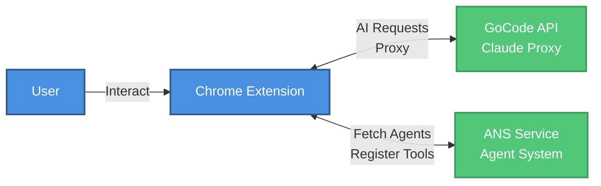

# ANS Browser Extension Architecture

## System Architecture Diagram



## Component Details

### 1. Extension Components

#### Sidepanel (`sidepanel.tsx`)
- **Purpose**: Main React UI component for chat interface
- **Responsibilities**:
  - User input handling
  - Message display and management
  - Settings management
  - AI provider selection (Anthropic)
  - Tool orchestration
  - Overlay management (in sidepanel)
- **Key Functions**:
  - `handleSubmit()` - Processes user messages
  - `streamAnthropicWithBrowserTools()` - Calls Anthropic with browser tools
  - `executeTool()` - Executes browser automation tools
  - `showBrowserAutomationOverlay()` - Shows automation overlay

#### Background Script (`background.ts`)
- **Purpose**: Service worker that coordinates extension components
- **Responsibilities**:
  - Message routing between sidepanel and content scripts
  - Content script injection
  - Tab management
  - Screenshot capture
  - Navigation control
  - Abort signal management
- **Key Message Handlers**:
  - `GET_TAB_INFO` - Returns current tab information
  - `EXECUTE_ACTION` - Forwards actions to content script
  - `TAKE_SCREENSHOT` - Captures page screenshots
  - `NAVIGATE` - Navigates to URLs
  - `INJECT_CONTENT_SCRIPT` - Injects content script on demand

#### Content Script (`content.ts`)
- **Purpose**: Injected into web pages for DOM interaction
- **Responsibilities**:
  - DOM manipulation (click, type, scroll)
  - Page context extraction
  - Element selection and interaction
  - Visual feedback (overlay, highlighting)
- **Key Functions**:
  - `executePageAction()` - Executes browser automation actions
  - `extractPageContext()` - Extracts page content, links, forms
  - `dispatchClickSequence()` - Simulates realistic click events
  - `highlightElement()` - Visual feedback for interactions

### 2. Internal APIs

#### Chrome Runtime API (`chrome.runtime`)
- **Communication**: Sidepanel ↔ Background Script
- **Messages**: Settings updates, abort signals, tool execution requests

#### Chrome Tabs API (`chrome.tabs`)
- **Communication**: Background Script ↔ Content Script
- **Messages**: Action execution, page context requests, overlay control

#### Chrome Scripting API (`chrome.scripting`)
- **Purpose**: Dynamic content script injection
- **Usage**: Inject `content.js` into tabs on demand

#### Chrome Storage API (`chrome.storage.local`)
- **Purpose**: Persistent storage
- **Data**: Settings, messages per tab, MCP session data, user preferences

#### Chrome SidePanel API (`chrome.sidePanel`)
- **Purpose**: Sidepanel management
- **Usage**: Enable/disable sidepanel per tab, open sidepanel

### 3. AI Provider Services

#### Anthropic Service (`anthropic-service.ts`)
- **Endpoint**: GoCode API (`https://caas-gocode-prod.caas-prod.prod.onkatana.net/v1/messages`)
- **Purpose**: Chat without browser tools
- **Models**: Claude Sonnet 4.5, Claude 3.5 Sonnet, etc.
- **Flow**: Sidepanel → Anthropic Service → GoCode → Claude API

#### Anthropic Browser Tools (`anthropic-browser-tools.ts`)
- **Endpoint**: GoCode API (same as above)
- **Purpose**: Chat with browser automation capabilities
- **Features**:
  - Multi-turn conversation loop (up to 20 turns)
  - Tool execution orchestration
  - Conversation history management
  - Message summarization
  - Abort signal handling
- **Tools**: navigate, clickElement, click, type, scroll, getPageContext, screenshot, pressKey

### 4. Tool Integration Services

#### MCP Service (`mcp-service.ts`)
- **Protocol**: Model Context Protocol (JSON-RPC 2.0 over HTTP)
- **Purpose**: Connect to MCP servers for custom tools
- **Features**:
  - Multi-server connection management
  - Tool discovery (`tools/list`)
  - Tool execution (`tools/call`)
  - Connection pooling per tab
- **Servers**: Custom MCP servers, ANS agents with MCP support

#### A2A Service (`a2a-service.ts`)
- **Protocol**: Agent-to-Agent Protocol (HTTP POST)
- **Purpose**: Connect to A2A agents for task execution
- **Features**:
  - Task-based execution
  - SDK-based conversational mode
  - Connection management
- **Agents**: GoDaddy ANS agents with A2A support

#### Tool Router (`mcp-tool-router.ts`)
- **Purpose**: Format MCP/A2A tools for Anthropic API
- **Function**: Converts tool schemas to Anthropic tool format

### 5. External APIs

#### GoCode API
- **URL**: `https://caas-gocode-prod.caas-prod.prod.onkatana.net`
- **Purpose**: GoDaddy's internal proxy for Anthropic API
- **Authentication**: API key in `x-api-key` header
- **Endpoints**:
  - `POST /v1/messages` - Chat and tool execution
- **Features**:
  - Proxies requests to Anthropic Claude API
  - Requires GoDaddy VPN connection
  - Handles authentication and rate limiting

#### Claude API (via GoCode)
- **Provider**: Anthropic
- **Models**: Claude Sonnet 4.5, Claude 3.5 Sonnet, Claude 3.5 Haiku, Claude 3 Opus
- **Access**: Only through GoCode proxy (no direct access)

#### Composio API
- **URL**: `https://backend.composio.dev/api/v3/labs/tool_router/session`
- **Purpose**: Tool Router for 500+ app integrations
- **Features**:
  - Session management
  - MCP URL generation
  - Tool discovery for Gmail, Slack, GitHub, etc.
- **Authentication**: Composio API key

#### ANS API
- **URL**: `https://api.ote-godaddy.com/v1/agents`
- **Purpose**: GoDaddy Agent Naming System
- **Features**:
  - Agent discovery
  - Agent configuration retrieval
  - Trusted agent verification
- **Authentication**: ANS API token

#### MCP Servers
- **Protocol**: JSON-RPC 2.0 over HTTP
- **Purpose**: Custom tool providers
- **Endpoints**:
  - `POST /` - JSON-RPC requests
  - Methods: `tools/list`, `tools/call`
- **Examples**: ANS agents, custom MCP servers

#### A2A Agents
- **Protocol**: HTTP POST
- **Purpose**: Task execution agents
- **Endpoints**: Agent-specific URLs
- **Examples**: GoDaddy business service agents

## Data Flow Examples

### 1. Browser Automation Flow (Anthropic + Browser Tools)

```
User Input → Sidepanel
  ↓
streamAnthropicWithBrowserTools()
  ↓
POST to GoCode API (/v1/messages)
  ↓
GoCode → Claude API
  ↓
Claude returns tool_use (e.g., navigate, clickElement)
  ↓
Sidepanel → executeTool()
  ↓
chrome.runtime.sendMessage → Background Script
  ↓
chrome.tabs.sendMessage → Content Script
  ↓
Content Script → DOM Manipulation
  ↓
Results flow back: Content Script → Background → Sidepanel
  ↓
Tool results added to conversation
  ↓
Loop continues until task complete or max turns
```

### 2. MCP Tool Execution Flow

```
User Input → Sidepanel
  ↓
Check for MCP tools (via MCP Service)
  ↓
Format tools for Anthropic (via Tool Router)
  ↓
Include in API request to GoCode
  ↓
Claude returns tool_use for MCP tool
  ↓
Sidepanel → MCP Service.executeToolCall()
  ↓
JSON-RPC request to MCP Server
  ↓
MCP Server → External Service (e.g., Gmail, Slack)
  ↓
Results → MCP Service → Sidepanel
  ↓
Tool results added to conversation
```

### 3. A2A Agent Execution Flow

```
User Input → Sidepanel
  ↓
Check for A2A tools (via A2A Service)
  ↓
Format tools for Anthropic
  ↓
Include in API request
  ↓
Claude returns tool_use for A2A tool
  ↓
Sidepanel → A2A Service.executeTask()
  ↓
HTTP POST to A2A Agent
  ↓
A2A Agent → External Service
  ↓
Results → A2A Service → Sidepanel
```

## Key Design Patterns

### 1. Message Passing Architecture
- **Pattern**: Chrome Extension Message Passing
- **Flow**: Sidepanel → Background → Content Script
- **Benefits**: Isolation, security, async communication

### 2. Tool Abstraction Layer
- **Pattern**: Unified tool interface
- **Implementation**: `executeTool()` wrapper function
- **Supports**: Browser tools, MCP tools, A2A tools

### 3. Multi-Provider Support
- **Pattern**: Provider abstraction
- **Providers**: Anthropic (via GoCode)
- **Selection**: User-configurable in settings

### 4. Tab-Based State Management
- **Pattern**: Per-tab state isolation
- **Storage**: `chrome.storage.local` with tab ID keys
- **Benefits**: Multiple concurrent conversations

### 5. Abort Signal Pattern
- **Pattern**: Cancellable async operations
- **Implementation**: `AbortController` and `AbortSignal`
- **Usage**: User cancellation, tab switching, error recovery

## Security Considerations

1. **Content Script Isolation**: Content scripts run in isolated world, cannot access page JavaScript
2. **Message Validation**: All messages validated before processing
3. **API Key Storage**: Stored in `chrome.storage.local` (encrypted by Chrome)
4. **VPN Requirement**: GoCode API requires GoDaddy VPN connection
5. **CSP Compliance**: Content scripts respect page Content Security Policy

## Performance Optimizations

1. **Lazy Loading**: MCP/A2A services initialized on demand
2. **Connection Pooling**: MCP connections reused across tool calls
3. **Message Caching**: Page context cached to reduce extraction overhead
4. **Conversation Trimming**: Old messages summarized or removed to manage context length
5. **Async Operations**: Non-blocking message passing and tool execution

